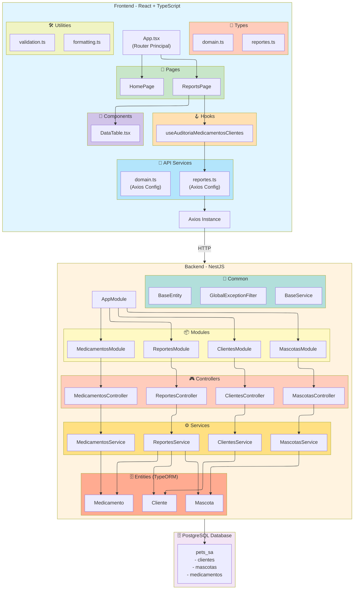

```mermaid
---
config:
    theme: default
    layout: elk
---
graph TB
    subgraph Frontend["Frontend - React + TypeScript"]
        AppTsx["App.tsx<br/>(Router Principal)"]
        
        subgraph Pages["📄 Pages"]
            HomePage["HomePage"]
            ReportsPage["ReportsPage"]
        end
        
        subgraph Hooks["🪝 Hooks"]
            UseAuditoria["useAuditoriaMedicamentosClientes"]
        end
        
        subgraph API["🔌 API Services"]
            DomainAPI["domain.ts<br/>(Axios Config)"]
            ReportesAPI["reportes.ts<br/>(Axios Config)"]
        end
        
        subgraph Utils["🛠️ Utilities"]
            Validation["validation.ts"]
            Formatting["formatting.ts"]
        end
        
        subgraph Components["🧩 Components"]
            DataTable["DataTable.tsx"]
        end
        
        subgraph Types["📘 Types"]
            DomainTypes["domain.ts"]
            ReportesTypes["reportes.ts"]
        end
        
        AppTsx --> HomePage
        AppTsx --> ReportsPage
        ReportsPage --> UseAuditoria
        UseAuditoria --> ReportesAPI
        ReportsPage --> DataTable
        ReportesAPI --> Axios["Axios Instance"]
    end
    
    subgraph Backend["Backend - NestJS"]
        AppModule["AppModule"]
        
        subgraph Modules["📦 Modules"]
            ClientesModule["ClientesModule"]
            MascotasModule["MascotasModule"]
            MedicamentosModule["MedicamentosModule"]
            ReportesModule["ReportesModule"]
        end
        
        subgraph Controllers["🎮 Controllers"]
            ClientesCtrl["ClientesController"]
            MascotasCtrl["MascotasController"]
            MedicamentosCtrl["MedicamentosController"]
            ReportesCtrl["ReportesController"]
        end
        
        subgraph Services["⚙️ Services"]
            ClientesService["ClientesService"]
            MascotasService["MascotasService"]
            MedicamentosService["MedicamentosService"]
            ReportesService["ReportesService"]
        end
        
        subgraph Entities["🗄️ Entities (TypeORM)"]
            ClienteEntity["Cliente"]
            MascotaEntity["Mascota"]
            MedicamentoEntity["Medicamento"]
        end
        
        subgraph Common["🔧 Common"]
            GlobalExceptionFilter["GlobalExceptionFilter"]
            BaseService["BaseService"]
            BaseEntity["BaseEntity"]
        end
        
        AppModule --> ClientesModule
        AppModule --> MascotasModule
        AppModule --> MedicamentosModule
        AppModule --> ReportesModule
        
        ClientesModule --> ClientesCtrl
        MascotasModule --> MascotasCtrl
        MedicamentosModule --> MedicamentosCtrl
        ReportesModule --> ReportesCtrl
        
        ClientesCtrl --> ClientesService
        MascotasCtrl --> MascotasService
        MedicamentosCtrl --> MedicamentosService
        ReportesCtrl --> ReportesService
        
        ClientesService --> ClienteEntity
        MascotasService --> MascotaEntity
        MedicamentosService --> MedicamentoEntity
        ReportesService --> ClienteEntity
        ReportesService --> MascotaEntity
        ReportesService --> MedicamentoEntity
    end
    
    subgraph Database["🗄️ PostgreSQL Database"]
        DB["pets_sa<br/>- clientes<br/>- mascotas<br/>- medicamentos"]
    end
    
    Axios -->|HTTP| Backend
    Backend --> DB
    
    style Frontend fill:#e1f5ff
    style Backend fill:#fff3e0
    style Database fill:#f3e5f5
    style Pages fill:#c8e6c9
    style Hooks fill:#ffe0b2
    style API fill:#b3e5fc
    style Utils fill:#f0f4c3
    style Components fill:#d1c4e9
    style Types fill:#ffccbc
    style Modules fill:#fff9c4
    style Controllers fill:#ffccbc
    style Services fill:#ffe082
    style Entities fill:#ffab91
    style Common fill:#b2dfdb
```