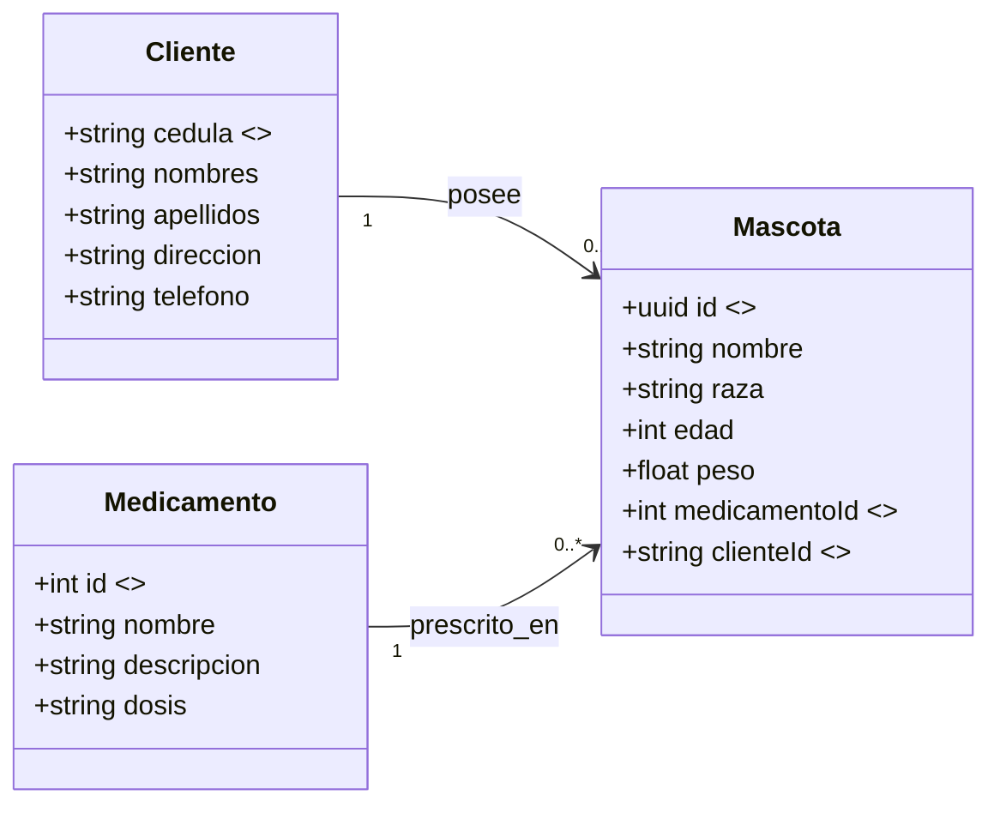

```mermaid
classDiagram
direction LR

class Cliente {
  +string cedula <<PK>>
  +string nombres
  +string apellidos
  +string direccion
  +string telefono
}

class Mascota {
  +uuid id <<PK>>
  +string nombre
  +string raza
  +int edad
  +float peso
  +int medicamentoId <<FK>>
  +string clienteId <<FK>>
}

class Medicamento {
  +int id <<PK>>
  +string nombre
  +string descripcion
  +string dosis
}

Cliente "1" --> "0..*" Mascota : posee
Medicamento "1" --> "0..*" Mascota : prescrito_en
```